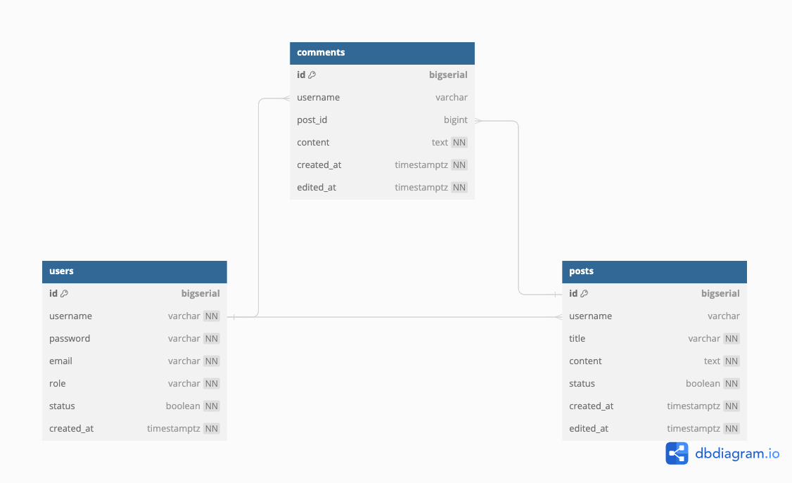

# simpleblog

In this project I'll try to use:
- Vannila Golang 1.22 (no framework)
- Golang's html/template 
- SQLC and PGX
- HTMX 

to create a simple blog

Special thanks to Microsoft's Copilot and Google's Gemini for helping me during building the project. Especially while building the front-end. 

Database design:

