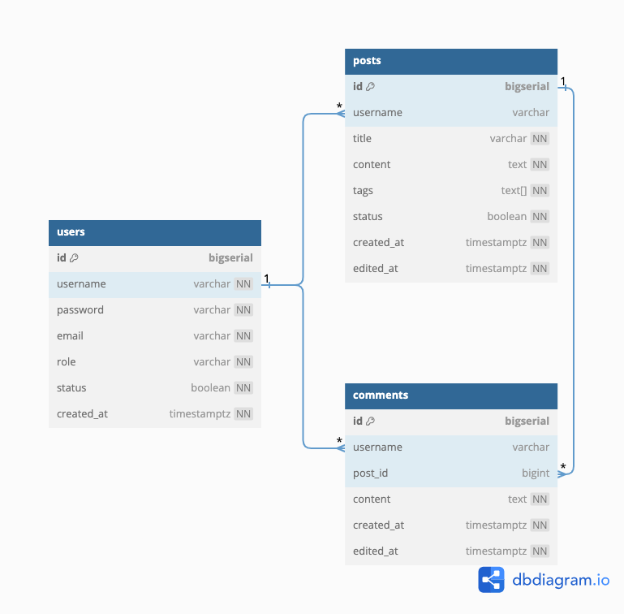
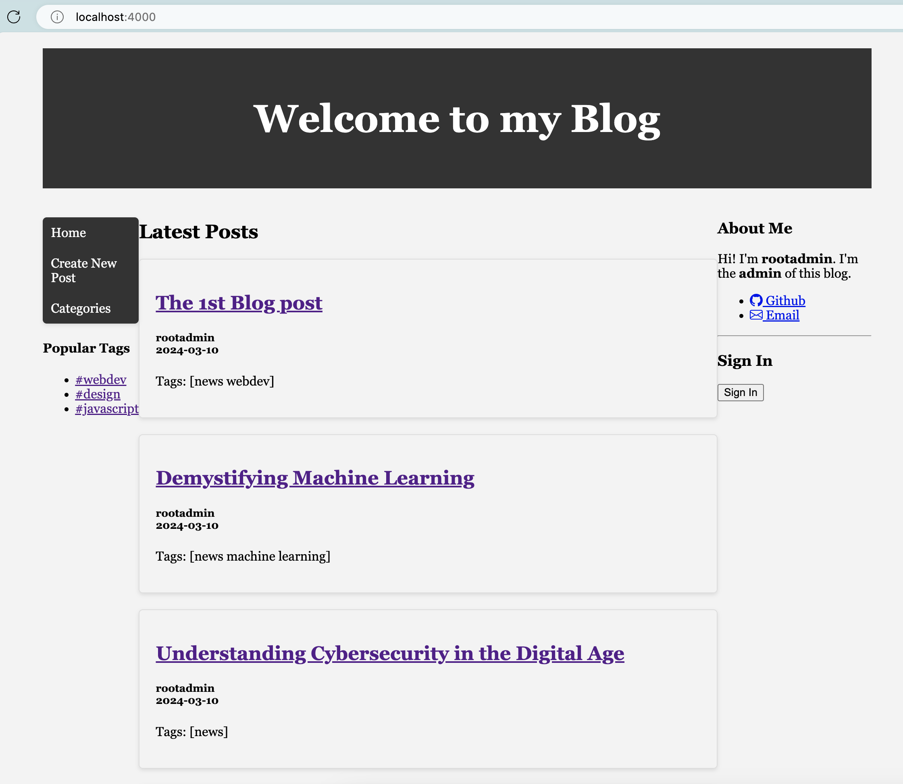
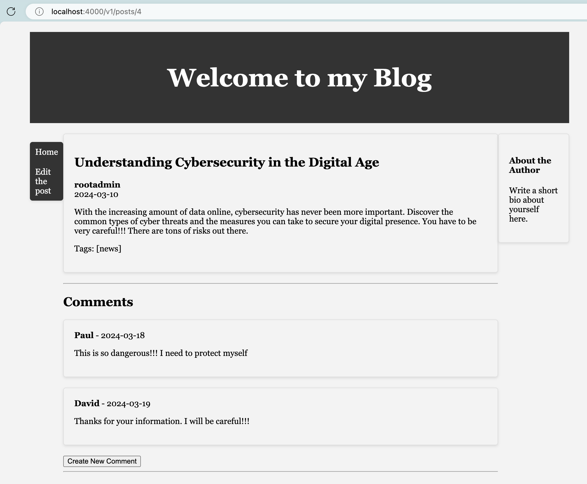

# simpleblog

In this project I'll try to use:
- Pure Golang 1.22 & html/template
- Pure CSS
- HTMX 
- SQLC and PGX
- Microsoft's Copilot & Google's Gemini free

to create a simple blog

Database design:

Main page's UI:

Post page's UI:

